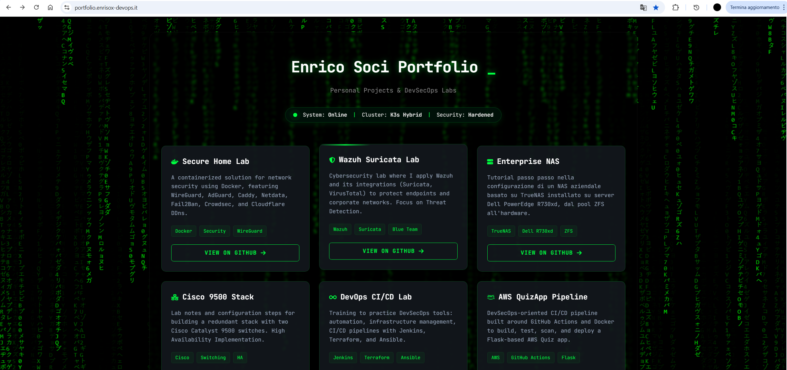
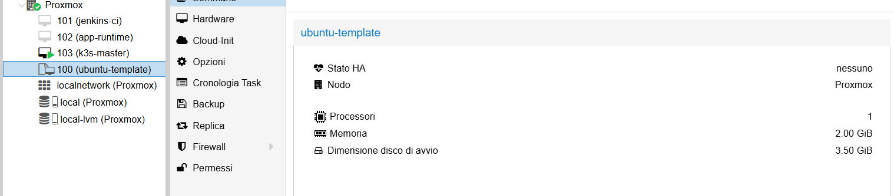
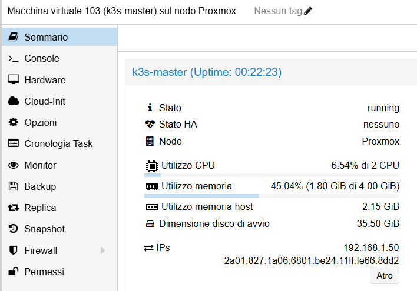
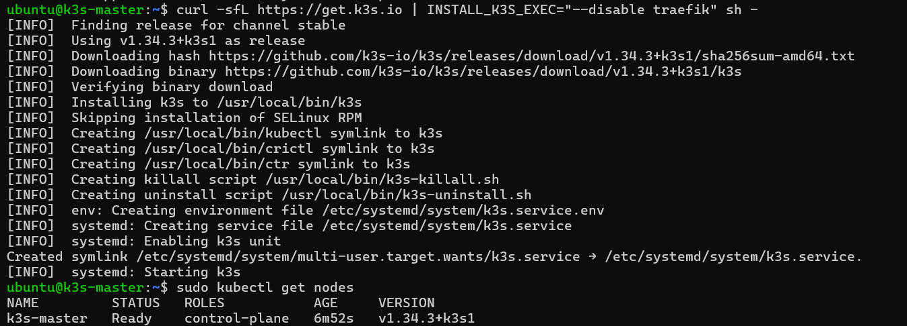

# Portfolio hostato su cluster Kubernetes K3S 



Questo progetto descrive la creazione di un'**infrastruttura K3s ibrida** partendo dal mio server **Proxmox** che ospiterà una VM ubuntu server come Nodo Master fino al mio **Raspberry Pi 5 (nodo Worker)**. <br>
**Ibrida a livello di:** <br>
- **architettura**: nodo Master su VM in Proxmox ( architettura x86_64/AMD64 ) e nodo worker su Raspberry Pi ( arch ARM64) 
- **piattaforme**: Virtuale e fisico.

## K3S 

**K3S è una versione super leggera di Kubernetes (K8s).È stato creato da Rancher Labs per essere installato facilmente su dispositivi con poche risorse, come un Raspberry Pi, o per ambienti di sviluppo e test rapidi.**

Punti chiave:

1. **Automazione con Cloud-Init**: Setup rapido della VM Master tramite template e iniezione di chiavi SSH/Rete.
2. **Ottimizzazione K3s**: Installazione leggera senza Traefik per delegare la gestione del traffico a Caddy esterno.
3. **Configurazione Raspberry**: Abilitazione dei cgroups per permettere al nodo worker di unirsi al cluster.
4. **Deployment Hardened**: Pubblicazione di un sito statico tramite ConfigMap e Nginx, con un forte focus sulla sicurezza (filesystem in sola lettura, utente non-root, limiti di CPU/RAM) per proteggere l'hardware sottostante da attacchi o sovraccarichi.
5. **Esposizione Sicura**: Utilizzo di Caddy come Reverse Proxy con header di sicurezza avanzati e gestione DNS per l'accesso pubblico via HTTPS.

## Setup Infrastruttura: Proxmox e K3s


Per creare la VM master, ho utilizzato una VM template su Proxmox, precedentemente creata in un altro mio progetto: --> https://github.com/Enrisox/DevOps-CI-CD-Lab-Jenkins-Terraform-Ansible. <br>

Ho poi eseguito un over-provisioning delle risorse del template originale (CPU e RAM), garantendo al nodo Master la potenza di calcolo richiesta dal piano di controllo di Kubernetes.

## Creazione VM Master

```bash
qm clone 100 103 --name k3s-master --full && \      
qm set 103 --cores 2 --memory 4096 --cpu host && \
qm resize 103 scsi0 +32G

```
**qm clone 100 103**crea una copia esatta della VM con ID 100 (che è il template pre-configurato) e assegna alla nuova VM l'ID 103.
**--name k3s-master**: Rinomina la nuova VM in "k3s-master" per riconoscerla facilmente.
**--full**: Questa è la parte importante. Crea un Full Clone. Significa che copia fisicamente tutto il disco. La nuova VM sarà totalmente indipendente dal template originale

Invece di accendere la VM e configurare IP, utenti e password a mano nel terminal della console, ho usato **Cloud-Init** per "iniettare" queste impostazioni dall'esterno mentre la macchina si avvia.


Per passare la chiave via comando, Proxmox deve leggere un file. <br>
Crea un file temporaneo con la tua chiave pubblica. Sulla shell di Proxmox:

```bash
nano /root/chiave.pub
```

**INCOLLA DENTRO LA TUA CHIAVE PUBBLICA**

### Configurazione Cloud-Init

**Configura il drive Cloud-Init cambiando ip, user e password**

```bash
qm set 103 --ide2 local-lvm:cloudinit \
--ciuser ubuntu \
--cipassword "************" \
--sshkeys /root/chiave.pub \
--ipconfig0 ip=192.168.1.X/24,gw=192.168.1.1 \
--agent enabled=1
```

**Rigenerare e avviare la VM master**

```bash
qm cloudinit update 103
qm start 103
```

## Configurazione VM Master


Una volta fatto accesso in ssh alla vm 103 tramite key auth ho aggiornato il sistema e installato agente sul nodo K3S master  ( prima era stato solamente abilitato, non installato)

```bash
sudo apt update && sudo apt upgrade -y
sudo apt install qemu-guest-agent -y

```
## Disabilire il firewall di Ubuntu (solo in ambiente di test)

- **Iptables**: K3s installa delle regole molto specifiche per far parlare i container tra loro. Se ufw è attivo, potrebbe sovrascrivere o bloccare i pacchetti che passano per l'interfaccia virtuale di K3s (cni0 o flannel), rendendo i tuoi Pod isolati dal mondo.
- **Porte necessarie** K3s ha bisogno di molte porte aperte (6443 per l'API, 10250 per il Kubelet, porte per il traffico VXLAN, ecc.). Invece di aprirle una per una rischiando di dimenticarne una e impazzire con i log, si disabilita il firewall dell'host, dato che la sicurezza dovrebbe essere gestita a un livello superiore (es. i Security Groups del cloud o il firewall del router).

```bash
sudo ufw disable`
```

## Installazione di K3s (Senza Traefik)


Ho scelto di disabilitare **Traefik**, un Reverse Proxy compreso in K3S, perché era già presente un **container Caddy** nell'infrastruttura del mio homelab e **NodePort** per gestire il traffico. Se avessi lasciato Traefik, mi avrebbe occupato le porte e fatto conflitto.
**NodePort**:È un oggetto di configurazione di Kubernetes che espone un servizio su una porta statica.
Apre una porta specifica (range 30000-32767) su tutte le interfacce di rete di ogni singolo nodo del cluster (Master e Worker).
Mappa una porta esterna alla porta interna del container (targetPort), rendendo il servizio raggiungibile tramite l'IP della macchina fisica/VM.

```bash
curl -sfL https://get.k3s.io | INSTALL_K3S_EXEC="--disable traefik" sh -`
```

**Di default, k3s richiede sudo per ogni comando kubectl. Per usare kubectl senza sudo, usiamo questo comando:**
```bash
sudo chmod 644 /etc/rancher/k3s/k3s.yaml
```

### Abilitare qemu agent sulla vm master

```bash
sudo systemctl enable qemu-guest-agent
sudo systemctl start qemu-guest-agent
sudo systemctl status qemu-guest-agent    

```

## Setup Nodo worker sul Raspberry Pi

### Copia token da dare a raspberry
```bash
sudo cat /var/lib/rancher/k3s/server/node-token         #Copia token da dare a raspberry
```

## Configurazione Cgroups

**I Raspberry Pi spesso hanno i "cgroups" disabilitati di default. Senza questi, K3s non parte.**

```bash
cat /boot/firmware/cmdline.txt
```

Cosa cercare?: In fondo alla riga, deve esserci scritto: **`cgroup_enable=cpuset cgroup_memory=1 cgroup_enable=memory`**

Se NON ci sono:

```bash
sudo nano /boot/firmware/cmdline.txt`
sudo reboot
```

### Unire il raspberry al cluster

Dopo il reboot:

```bash
curl -sfL https://get.k3s.io | K3S_URL=https://192.168.1.X:6443 K3S_TOKEN="K10***********token::server:token****************" sh -
```


**Verificare dal nodo master:**


```bash
sudo kubectl get nodes`
```


