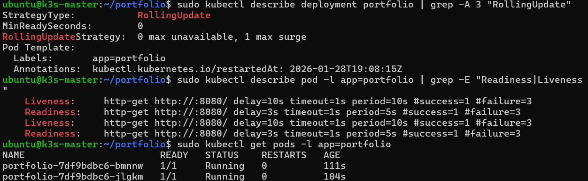

# Zero-Downtime Deployment con Rolling Update e Health Probes

Questo step descrive come Kubernetes garantisce aggiornamenti applicativi
**senza interruzione del servizio**, utilizzando:

- Rolling Update
- Readiness Probe
- Liveness Probe
- Rollout controllato


## Obiettivo

Durante un aggiornamento:
- almeno un Pod rimane sempre disponibile
- i nuovi Pod ricevono traffico solo quando pronti
- i Pod difettosi vengono riavviati automaticamente


## Strategia di Rolling Update

Configurazione applicata al Deployment:

- maxUnavailable: 0 → nessun Pod viene terminato finché il nuovo non è Ready

- maxSurge: 1  → Kubernetes può creare temporaneamente un Pod extra

Questo garantisce **zero-downtime reale**.

Ho aggiunto queste righe al mio file portfolio.yml:
```bash
nano portfolio.yaml​
```
- **maxUnavailable: 0**	Impedisce la terminazione di Pod finché i nuovi non sono Ready --> Zero secondi di downtime garantito 
- **maxSurge: 1**  Permette un Pod extra temporaneo durante il rollout --> Capacità sempre >= 100% 
- **Readiness/Liveness Probe**	Testa quando un Pod può ricevere traffico per evitare error 502 durante rollout e rileva Pod bloccati e li riavvia automaticamente  --> Self-healing automatico
- **Stakater Reloader**	Automazione completa del rollout quando cambia la ConfigMap
​- **kubectl rollout history**	Facilita rollback rapidi in caso di problemi
​- **Metrics Server + kubectl top**	Monitoring real-time delle risorse per validare i limits

```bash
apiVersion: apps/v1
kind: Deployment
metadata:
  name: portfolio
spec:
  replicas: 2
  strategy:
    type: RollingUpdate
    rollingUpdate:
      maxUnavailable: 0  # Mai spegnere un Pod finché il nuovo non è Ready
      maxSurge: 1        # Permetti 1 Pod extra durante il rollout (max 3 temporanei)
  selector:
    matchLabels:
      app: portfolio
  template:
    metadata:
      labels:
        app: portfolio
    spec:
      securityContext:
        runAsNonRoot: true
        runAsUser: 101
        runAsGroup: 101
        fsGroup: 101
        seccompProfile:
          type: RuntimeDefault
      containers:
      - name: nginx
        image: nginxinc/nginx-unprivileged:alpine
        ports:
        - containerPort: 8080
        resources:
          requests:
            memory: "64Mi"
            cpu: "50m"
          limits:
            memory: "256Mi"
            cpu: "500m"
        securityContext:
          allowPrivilegeEscalation: false
          readOnlyRootFilesystem: true
          privileged: false
          capabilities:
            drop:
              - ALL
        readinessProbe:
          httpGet:
            path: /
            port: 8080
          initialDelaySeconds: 3
          periodSeconds: 5
          failureThreshold: 2
        livenessProbe:
          httpGet:
            path: /
            port: 8080
          initialDelaySeconds: 10
          periodSeconds: 10
          failureThreshold: 3
        volumeMounts:
        - name: html-volume
          mountPath: /usr/share/nginx/html
        - name: tmp-volume
          mountPath: /tmp
        - name: cache-volume
          mountPath: /var/cache/nginx
      volumes:
      - name: html-volume
        configMap:
          name: portfolio-html
      - name: tmp-volume
        emptyDir: {}
      - name: cache-volume
        emptyDir: {}
---
apiVersion: v1
kind: Service
metadata:
  name: portfolio-service
spec:
  selector:
    app: portfolio
  type: NodePort
  ports:
    - port: 80
      targetPort: 8080
      nodePort: *****    #metti porta
```
## Applica le modifiche
```bash
kubectl apply -f portfolio.yaml
```
**Kubernetes eseguirà un aggiornamento progressivo (Rolling Update) per attivare le nuove Probe e le Strategy senza mai interrompere il servizio.**


## Collaudo delle Strategie e delle Probe


Verifichiamo che la strategia Zero-Downtime e le sentinelle di controllo (Readiness e Liveness) siano attive.

```bash
kubectl describe deployment portfolio | grep -A 3 "RollingUpdate"
```

StrategyType:           RollingUpdate
RollingUpdateStrategy:  0 max unavailable, 1 max surge

```bash
​kubectl describe pod -l app=portfolio | grep -E "Readiness|Liveness"
```

**Verifica dei Pod**

```bash
kubectl get pods -l app=portfolio
```
# Gestione degli Aggiornamenti (Rollout)
In Kubernetes, se modifichi una ConfigMap, i Pod già in esecuzione non se ne accorgono perché hanno già caricato il file in memoria. Per rendere effettive le modifiche senza spegnere il sito, utilizziamo il comando di Rollout.

Il **comando Rollout Restart** comando ordina a Kubernetes di ricreare tutti i Pod del deployment seguendo la strategia definita:

```bash
kubectl rollout restart deployment portfolio && kubectl rollout status deployment portfolio         #per vedere lo stato in diretta
```

## Processo in background

- **Creazione (Surge)**: Grazie a maxSurge: 1, Kubernetes crea un terzo Pod aggiornato.
- **Test di Readiness**: Il nuovo Pod viene messo "in prova". Solo dopo che la readinessProbe dà esito positivo (il sito risponde), il Pod è considerato pronto.
- **Sostituzione**: Kubernetes inizia a terminare uno dei vecchi Pod.
- **Continuità**: La procedura si ripete finché tutti i vecchi Pod non sono sostituiti.
- **Risultato finale**: Durante tutto il processo, il traffico gestito da Caddy viene indirizzato solo ai Pod sani. L'utente non percepirà alcuna interruzione (Zero-Downtime).


