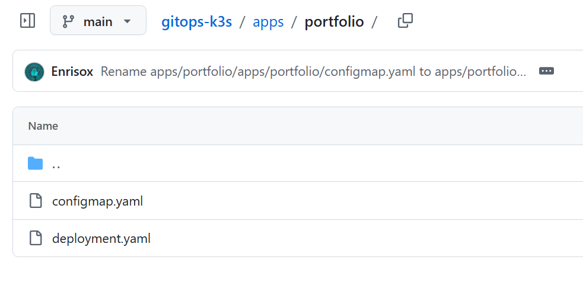
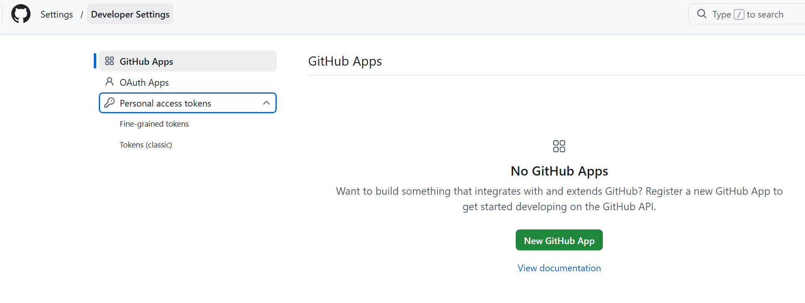
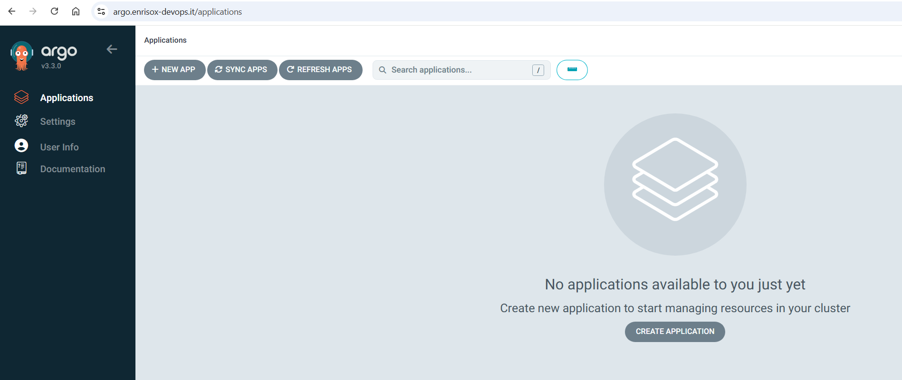
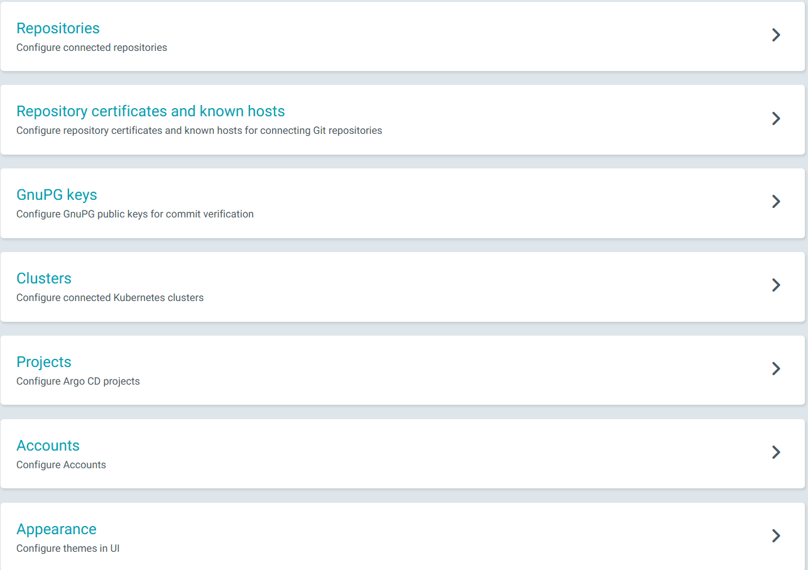
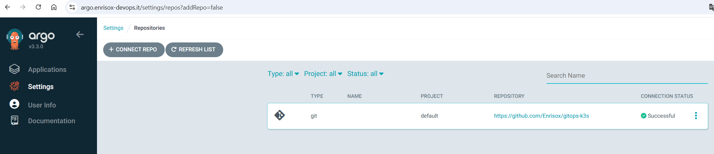
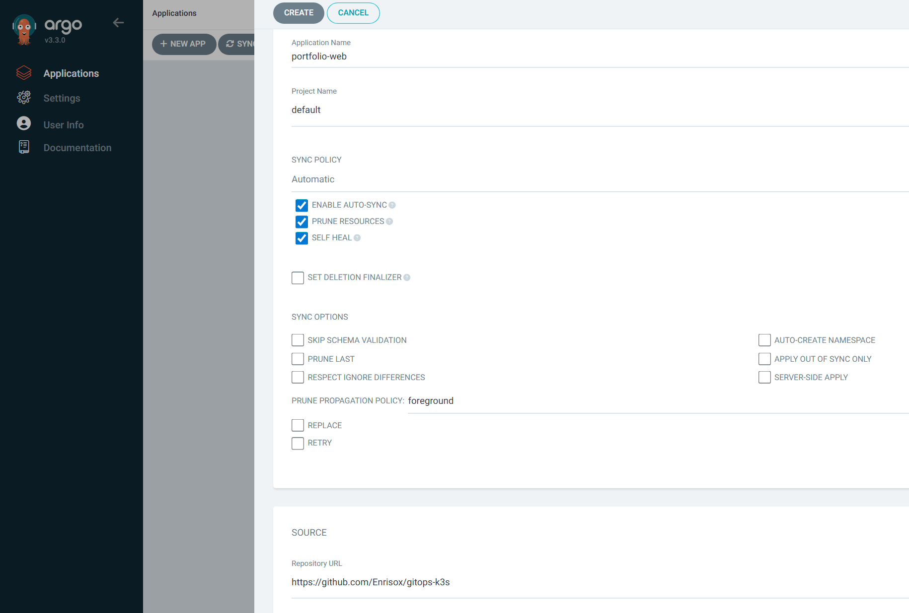
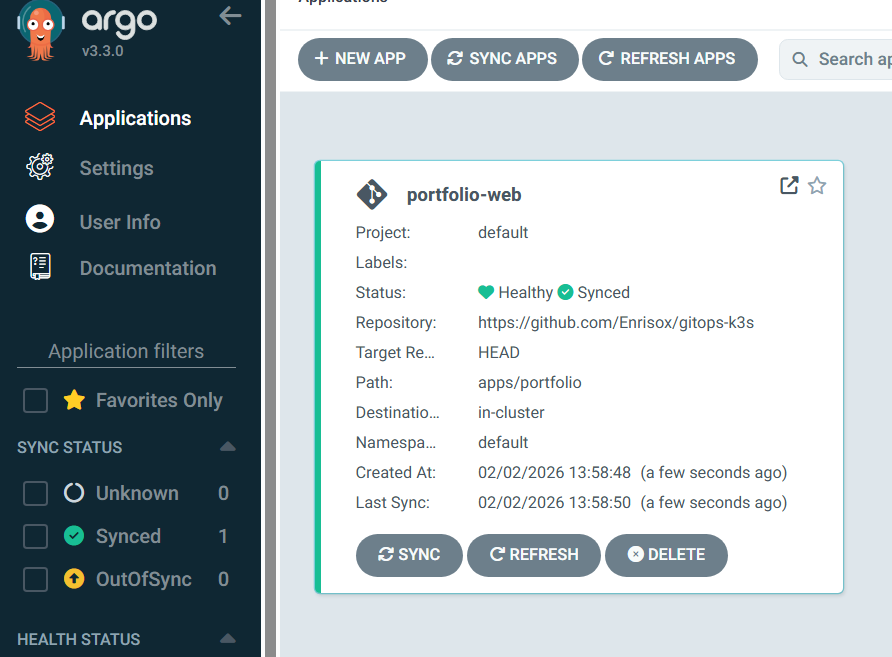

# From Imperative Control to Declarative GitOps

In the previous steps, autoscaling and rollouts were managed in an imperative way, using direct commands to the cluster to modify replicas or update Pods.

With **GitOps**, the entire desired state of the cluster — Deployment, ConfigMap, HPA, services — is defined in YAML files within a Git repository. A controller like **ArgoCD** continuously compares the desired state with the current state and automatically applies the necessary changes.

**This approach guarantees idempotent, reproducible, and secure updates, with automatic rollbacks, self-healing, and continuous synchronization, eliminating the need for direct manual interventions on the cluster.**

GitOps is a paradigm that says: "Everything that needs to be installed in my cluster must be written inside a Git repository."

**The pillars of GitOps are:**

1. **Git as the single source of truth**: The terminal (`kubectl apply`) is no longer used to change things. If you want 5 replicas instead of 2, you write it in the file on GitHub.
2. **Desired State vs. Current State**: You describe on Git how you want the cluster to be (Desired State). The GitOps tool checks how the cluster actually is (Current State).
3. **Automatic Synchronization**: If the two states do not coincide, the tool automatically corrects the cluster.

## What is ArgoCD?


**Argo CD** is a **declarative GitOps continuous delivery tool for Kubernetes**. It automates the deployment and updates of applications in Kubernetes clusters, ensuring consistency and reducing manual errors. It is one of the four sub-projects of the Argo Project, which in December 2022 received graduation from the Cloud Native Computing Foundation (CNCF), guaranteeing its security and reliability even on a large scale.

* **Monitors GitHub**: Checks my repository every few seconds.
* **Monitors the Cluster**: Looks at my Pods and Services on K3s.
* **Compares**: Notices the differences. If a comment is added or a port changes on GitHub, it notices.
* **Applies**: If it sees a difference, it pulls the files from GitHub and applies them to the cluster.

# GitOps with ArgoCD: Automatic sync, self-healing, and rollout

## ArgoCD Installation

```bash
kubectl create namespace argocd   # Creates the namespace
kubectl apply -n argocd -f https://raw.githubusercontent.com/argoproj/argo-cd/stable/manifests/install.yaml   

```

**Optimization: Forcing ArgoCD on the Master VM**

To prevent the Raspberry from being slowed down, I forced all ArgoCD components to run exclusively on the VM (k3s-master node) using the **nodeSelector**.

```bash
kubectl patch deployment argocd-server -n argocd -p '{"spec": {"template": {"spec": {"nodeSelector": {"kubernetes.io/hostname": "k3s-master"}}}}}'
kubectl patch deployment argocd-repo-server -n argocd -p '{"spec": {"template": {"spec": {"nodeSelector": {"kubernetes.io/hostname": "k3s-master"}}}}}'
kubectl patch deployment argocd-redis -n argocd -p '{"spec": {"template": {"spec": {"nodeSelector": {"kubernetes.io/hostname": "k3s-master"}}}}}'
kubectl patch deployment argocd-dex-server -n argocd -p '{"spec": {"template": {"spec": {"nodeSelector": {"kubernetes.io/hostname": "k3s-master"}}}}}'
kubectl patch deployment argocd-notifications-controller -n argocd -p '{"spec": {"template": {"spec": {"nodeSelector": {"kubernetes.io/hostname": "k3s-master"}}}}}'
kubectl patch deployment argocd-applicationset-controller -n argocd -p '{"spec": {"template": {"spec": {"nodeSelector": {"kubernetes.io/hostname": "k3s-master"}}}}}'
kubectl patch statefulset argocd-application-controller -n argocd -p '{"spec": {"template": {"spec": {"nodeSelector": {"kubernetes.io/hostname": "k3s-master"}}}}}'

```

**Exposing the service as NodePort:**

```bash
kubectl patch svc argocd-server -n argocd -p '{"spec": {"type": "NodePort"}}'

```

**Finding the assigned port:**

```bash
kubectl get svc -n argocd argocd-server

```

## Create or modify the Caddyfile:

```plaintext
argo.enrisox-devops.it {
    reverse_proxy https://192.168.1.X:30260 {
        transport http {
            tls_insecure_skip_verify
        }
    }
}

```

## Then reload the Caddy container:

```
sudo systemctl restart caddy

```

## Extract and copy the decrypted password

```bash
kubectl -n argocd get secret argocd-initial-admin-secret -o jsonpath="{.data.password}" | base64 -d; echo

```

**From the PC browser, I opened the subdomain I created to access Argo:**

Login:

* User: admin
* Password: The one copied

**Pod Verification**

```bash
kubectl get pods -n argocd

```

## Creating a private repository on GitHub


**I created two files in the repository**

```bash
- apps/portfolio/deployment.yaml   #containing both the deployment and the service
- apps/portfolio/configmap.yaml    #containing the html file of my portfolio website

```

## GitHub Token


* In GitHub account settings
* In the left column, scroll to the bottom and click on Developer settings.
* There you will find Personal access tokens. Click on it and choose Tokens (classic).
* check the **repo** box which contains the necessary permissions
* EXPIRATION 30 DAYS or 60



Settings -> Repositories -> + CONNECT REPO and choose https:


* **Type**: git.
* **Project**: default.
* **Repository URL**: Paste the HTTPS address of your repo (e.g.: [https://github.com/YourUsername/k3s-gitops-infra.git](https://www.google.com/search?q=https://github.com/YourUsername/k3s-gitops-infra.git)).
* **Username**: Enter your GitHub username.
* **Password**: Paste here the Token (PAT) generated earlier (the one starting with ghp_).
* **TLS client certificate / SSH private key**: Leave blank, they are not needed for HTTPS connection with a token.

If after pressing connect there is a green dot and it says successful, it worked.



## Creating an Application on ArgoCD


From the ArgoCD dashboard, click on + New App and fill it out as follows:

* **Application Name**: portfolio-app
* **Project**: default
* **Repository URL**:
* **Path**: apps/portfolio
* **Automated Sync**: automatically applies differences between Git and cluster.
* **Prune**: if I delete a YAML from Git, ArgoCD also deletes the resource from the cluster.
* **Self-Heal**: if someone manually modifies the cluster, ArgoCD brings it back to the state declared on Git.

**Destination:**

* Cluster URL: [https://kubernetes.default.svc](https://www.google.com/search?q=https://kubernetes.default.svc)
* Namespace: default

**Create.**


## Automatic update workflow (Git → ArgoCD → Kubernetes)

With ArgoCD in **Automatic Sync**, every commit/push to the repository containing the manifests triggers synchronization (either via polling or via webhook).

**Logical flow:**

1. Modify the manifests (or the ConfigMap) in the repo.
2. "git commit" + "git push".
3. ArgoCD detects the change and applies the updated manifests in the cluster.
4. Kubernetes performs a RollingUpdate of the Deployment respecting "maxUnavailable/maxSurge" and the probes → **zero-downtime**.
5. ArgoCD dashboard shows "Synced" and "Healthy".
